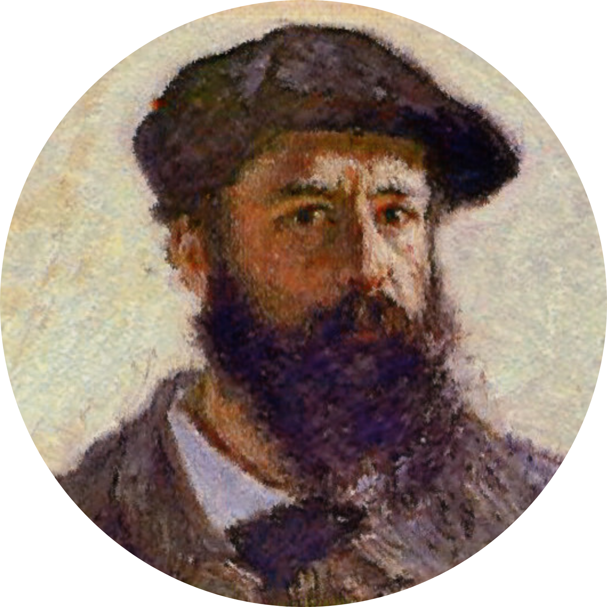

# Monet for ManyChat
With Monet you will be able to get the Profile Picture URL of the current user from ManyChat API.
One simple action without the technical fuzz of an external request.

Like Monet's paintings... Looks good from afar - but far from good close up

# Setup
+ Install the App
+ Configure Monet with your *ManyChat API Key*
+ Inside a flow, use the Monet action **🙂 Get Profile Picture** and asign the response to a *Custom User Field*
